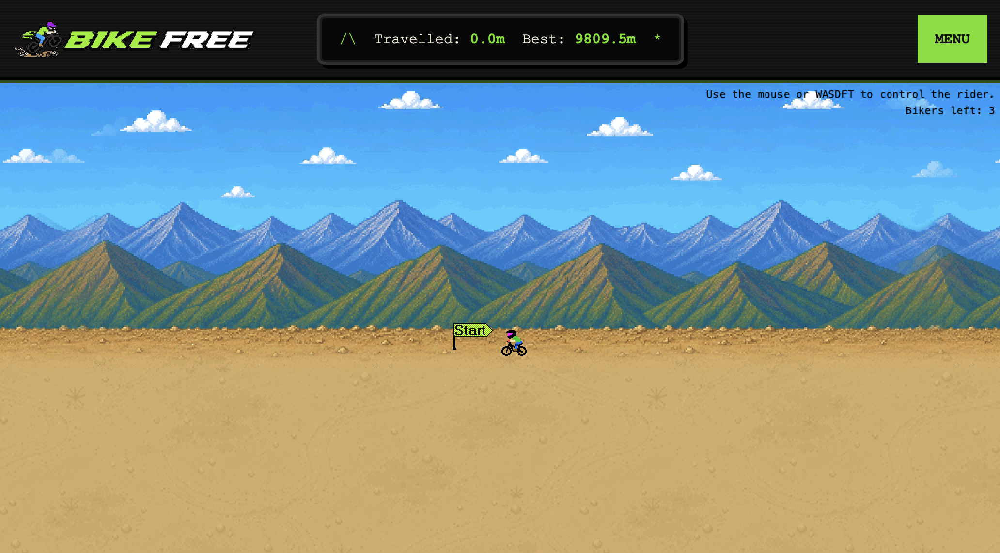

# Bike Free

A tiny retro mountain-bike survival game inspired by SkiFree.

Ride as far as you can, dodge rocks and trees, boost when things get sketchy, send tricks, and try to land on the leaderboard.

**Play:** https://playbike.free



---

## What is this?

Bike Free is a standalone browser game built with JavaScript and canvas.

It began as an adaptation of a JavaScript SkiFree-style engine and was rebuilt into a retro mountain bike survival game with custom UI, gameplay tweaks, score tracking, sign-in, and leaderboard support.

---

## Features

- Retro browser-based gameplay
- Mouse and keyboard controls
- Distance tracking
- Boost input
- Trick input
- Crash / obstacle survival loop
- High score leaderboard
- Optional sign-in to save scores
- Pixel-art UI and terrain
- Standalone deployment at `playbike.free`

---

## Controls

| Action | Control |
|---|---|
| Steer | Mouse, click/tap, `A/D`, or arrow keys |
| Pedal | `W` |
| Brake | `S` |
| Boost | `F` |
| Trick / backflip | `T` while airborne |

---

## Local development

This project uses Node.

The local Node version is pinned with `.nvmrc`.

```bash
nvm use
npm install
npm run dev
```

## Credits

Bike Free is adapted from the original open-source JavaScript SkiFree project:

**Original project:** [basicallydan/skifree.js](https://github.com/basicallydan/skifree.js)  
**Original author:** Dan Hough and contributors

Bike Free builds on that foundation and adds mountain-bike-specific gameplay, custom UI, scoring, leaderboard support, deployment, and visual direction.